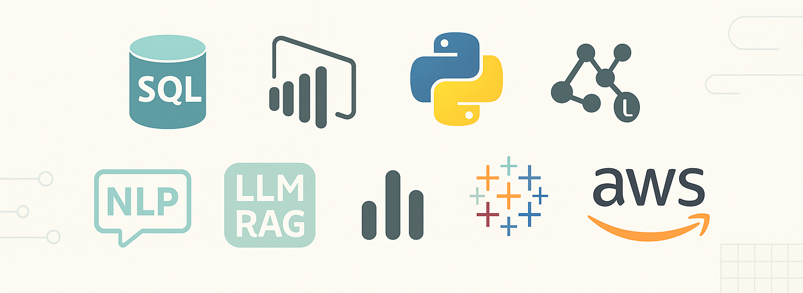

  

### I’m a passionate data professional skilled in transforming raw data into actionable insights. My expertise includes SQL, Python, Power BI, and Tableau, and I’m currently advancing my knowledge in Machine Learning, AWS, and Large Language Models (LLMs) for document intelligence.

### 🌱 About Me
I began my data science journey with a drive to solve real-world problems through data. I enjoy uncovering insights, enabling data-driven decisions, and embracing emerging technologies. My projects aim to deliver end-to-end solutions that bring real business value.

### 🎯 Future Goals
As I continue to grow in my data science career, I aim to specialize in deep learning and artificial intelligence. I'm particularly excited about the potential of large language models (LLMs) and their ability to transform how we interact with and analyze data. My goal is to build innovative, intelligent systems that can improve decision-making processes and create more efficient solutions.
 
### 🔧 Tech Stack 

### 🧪 Internship Experience
###    Data Science with AI
**Company Name:** Besant Technologies  
**Duration:** Jun 2024 – Present
**Location:** Chennai 

#### Key Responsibilities:
- Developed data-driven solutions using SQL and Python to analyze large datasets and extract actionable insights.
- Collaborated with a team of data scientists to implement machine learning models to predict customer behavior.
- Automated the process of data collection and analysis, reducing processing time by 30%.
- Worked closely with the business team to create interactive dashboards in Tableau for real-time decision-making.

### 🚀 Featured Projects 
### 🔸[AI-Powered RAG Assistant Using LangChain and Gradio](https://github.com/Keerthana-DS-ghub/AI-Powered-RAG-Assistant-Using-LangChain-and-Gradio)
 - Developed a Retrieval-Augmented Generation (RAG) chatbot using LangChain, IBM WatsonX Embeddings, ChromaDB, and Gradio
 - Implemented document loaders, semantic retrieval, and vector store integration for context-aware question answering
 - Built and deployed an interactive QA interface as part of Coursera’s “Generative AI Applications with RAG and LangChain” course
### 🔸 [NLP Text Preprocessing (Python)](https://github.com/Keerthana-DS-ghub/Text_Preprocessing/blob/main/README.md)
 - Designed an end-to-end text preprocessing pipeline: tokenization, normalization, stopword removal, and text standardization
 - Applied stemming and lemmatization to enhance text quality for NLP models
 - Prepared refined datasets for classification, summarization, and topic modeling
 ### 🔸 [Real-Time AMFI Mutual Fund Data Analysis (Python, MySQL, Power BI)](https://github.com/Keerthana-DS-ghub/-Real-Time-AMFI-Mutual-Fund-Data-Analysis)
  - Automated extraction of mutual fund data from AMFI using Python
  - Cleaned and transformed raw data using Pandas for analysis
  - Stored and updated data in a real-time MySQL database
  - Designed interactive Power BI dashboards to visualize fund trends
  - Enabled stakeholders with live, actionable insights for investment decisions
### 🔸 [Pandas: Hotel Booking Insights (Python)](https://github.com/Keerthana-DS-ghub/Analysing_Hotel_booking)
 - Data cleaning, merging, outlier removal (3-sigma rule)
 - EDA and visualization using Pandas & Matplotlib

### 📂 Other Projects
### 🔸 [SQL Project: Sales Forecast & Revenue Analysis](https://github.com/Keerthana-DS-ghub/SQL_Project)
  - Multi-table analysis using MySQL
  - Forecast logic, deductions, and manufacturing cost breakdown
  - Power BI dashboard integration
### 🔸 [PowerBI: Employee Performance Analysis](https://github.com/Keerthana-DS-ghub/Employee-Performance-Analysis)
  - Built an interactive HR analytics dashboard
  - Analyzed attrition, performance, salary hike trends, and job satisfaction
  - Used DAX measures, custom visualizations, and dynamic slicers in Power BI

 
### 🧠 Certifications

- **Generative AI Applications with RAG and LangChain – IBM**    **Jun 2025**   
- **Tableau Data Analyst Certification – Udemy**                 **Mar 2025**               
- **Master Data Science & AI Certified**                         **Apr 2025**                       

  

### 💬 Connect with Me 
📧 Email: [skeerthi.datascience@gmail.com](mailto:skeerthi.datascience@gmail.com)  
💼 LinkedIn: [Keerthana S](https://www.linkedin.com/in/keerthana-datascience/)

