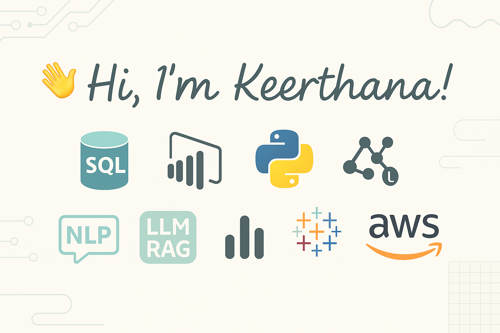

### 👋 I’m a passionate data professional with a Postgraduate degree in Computer Science. My expertise lies in transforming raw data into powerful insights using tools like SQL, Python, and Power BI. I'm currently diving deeper into Machine Learning, AWS, and the exciting world of LLMs and RAG for document intelligence.

### I believe in learning by doing, and my GitHub showcases real-time, end-to-end projects that solve actual business problems. 🚀  

## 📊 My GitHub Stats  

  

## 🧰 Tech Stack & Skills

## Internship Experience
### Data Science With AI 
**Company Name:** Besant Technologies  
**Duration:** June 2024 – Present 
**Location:** Chennai 

#### Key Responsibilities:
- Developed data-driven solutions using SQL and Python to analyze large datasets and extract actionable insights.
- Collaborated with a team of data scientists to implement machine learning models to predict customer behavior.
- Automated the process of data collection and analysis, reducing processing time by 30%.
- Worked closely with the business team to create interactive dashboards in Tableau for real-time decision-making.

## 📂 Featured Projects
### 🔸 [Hotel Booking Insights (Python)](https://github.com/Keerthana-DS-ghub/Analysing_Hotel_booking)
- Data cleaning, merging, outlier removal (3-sigma rule)
- EDA and visualization using Pandas & Matplotlib
### 🔸 [SQL Project: Sales Forecast & Revenue Analysis](https://github.com/Keerthana-DS-ghub/SQL_Project)
- Multi-table analysis using MySQL
- Forecast logic, deductions, and manufacturing cost breakdown
- Power BI dashboard integration

## 🎓 Certifications  
✔ [Tableau Data Analyst Certification - Udemy]

## 📫 Connect with Me  
📧 Email: skeerthi.datascience@gmail.com 
💼 LinkedIn: Keerthana S(https://www.linkedin.com/in/keerthana-datascience/)
