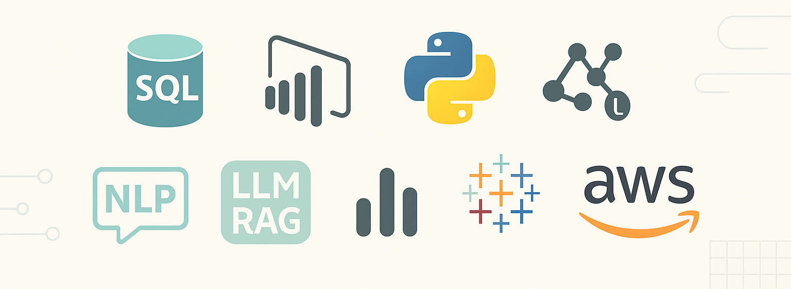

  

### AI Engineer passionate about building production-ready Generative AI applications, intelligent data solutions, and scalable machine learning systems. I enjoy transforming complex business challenges into AI-powered products using LLMs, RAG architectures, data analytics, and modern software engineering practices.

### 🌱 ### About Me

I'm a Junior AI Engineer passionate about building production-ready AI applications using Generative AI, Large Language Models (LLMs), Retrieval-Augmented Generation (RAG), FastAPI, and data-driven systems.

Currently, I work on AI-powered business intelligence solutions, transforming meeting data, customer interactions, and business signals into actionable insights through intelligent automation and analytics.

My interests include:
- Generative AI & LLM Applications
- AI Agents & Intelligent Automation
- RAG Systems & Knowledge Retrieval
- Machine Learning & Predictive Analytics
- FastAPI & AI Backend Development
- LLMOps & AI Deployment

### 🔭 Current Focus

- Building AI-powered Client Intelligence Systems
- Developing GenAI applications using LLMs and RAG
- Learning AI Agents and Agentic Workflows
- Exploring LLMOps and AI Deployment
- Creating production-ready AI solutions
 
### 🔧 Tech Stack 

### 🤖 AI & GenAI
Python • OpenAI • Claude • LangChain • LlamaIndex • Watsonx.ai • RAG • ChromaDB • Vector Databases

### ⚙️ Backend
FastAPI • SQLAlchemy • PostgreSQL • REST APIs • Alembic

### 📊 Data & ML
Pandas • NumPy • Scikit-Learn • Machine Learning • Statistics

### 📈 Visualization
Power BI • Tableau • Matplotlib

### ☁️ Cloud & DevOps
AWS • Git • GitHub • Railway • Vercel

### 💻 Frontend
Next.js • React • TypeScript • Tailwind CSS

### 📌 Highlights

✔ Built and deployed a live GenAI portfolio application

✔ Developed RAG-based question-answering systems using LangChain

✔ Implemented AI-powered meeting intelligence solutions

✔ Created end-to-end machine learning and analytics projects

✔ Experienced with LLM integration, vector databases, and FastAPI development

### 🧪 Internship Experience
###    Data Science with AI
**Company Name:** Besant Technologies  
**Duration:** Jun 2024 – Present
**Location:** Chennai 

#### Key Responsibilities:
- Developed data-driven solutions using SQL and Python to analyze large datasets and extract actionable insights.
- Collaborated with a team of data scientists to implement machine learning models to predict customer behavior.
- Automated the process of data collection and analysis, reducing processing time by 30%.
- Worked closely with the business team to create interactive dashboards in Tableau for real-time decision-making.

### 🚀 Featured Projects
## 🔸🌐[Live GenAI Portfolio (Production Deployed)](https://github.com/Keerthana-DS-ghub/Genai-portfolio)
🚀 **Interactive AI portfolio with a live recruiter-facing AI assistant**

🔗 **Live App:**  
https://keerthana-ds-ghub-genai-portfolio-landing-dmqphl.streamlit.app/

**Highlights**
- Production-ready Streamlit app with a live AI assistant
- Custom system prompt to ensure profile-grounded, non-hallucinating responses
- Watsonx LLM integration with secure cloud deployment (LLMOps)
- Recruiter-friendly UI showcasing skills, projects, certifications, and contact details

### 🔸[AI-Powered RAG Assistant Using LangChain and Gradio](https://github.com/Keerthana-DS-ghub/AI-Powered-RAG-Assistant-Using-LangChain-and-Gradio)
 - Developed a Retrieval-Augmented Generation (RAG) chatbot using LangChain, IBM WatsonX Embeddings, ChromaDB, and Gradio
 - Implemented document loaders, semantic retrieval, and vector store integration for context-aware question answering
 - Built and deployed an interactive QA interface as part of Coursera’s “Generative AI Applications with RAG and LangChain” course
### 🔸 [NLP Text Preprocessing (Python)](https://github.com/Keerthana-DS-ghub/Text_Preprocessing/blob/main/README.md)
 - Designed an end-to-end text preprocessing pipeline: tokenization, normalization, stopword removal, and text standardization
 - Applied stemming and lemmatization to enhance text quality for NLP models
 - Prepared refined datasets for classification, summarization, and topic modeling

### 🔸 [Time Series Forecasting with ARIMA & SARIMAX](https://github.com/Keerthana-DS-ghub/Time-Serie-Arima-Sarimax)
- Built **time series forecasting models** using **ARIMA** and **SARIMAX** to predict trends in real-world datasets.
- Performed **data preprocessing**, **stationarity testing**, and **seasonality analysis** for accurate predictions.
- Evaluated model performance with **RMSE** and **visualized forecasts** using Python libraries like **Pandas**, **Matplotlib**, and **Statsmodels**.
- Demonstrated practical application in **predictive analytics** for business and financial data.

 ### 🔸 [Real-Time AMFI Mutual Fund Data Analysis (Python, MySQL, Power BI)](https://github.com/Keerthana-DS-ghub/-Real-Time-AMFI-Mutual-Fund-Data-Analysis)
  - Automated extraction of mutual fund data from AMFI using Python
  - Cleaned and transformed raw data using Pandas for analysis
  - Stored and updated data in a real-time MySQL database
  - Enabled stakeholders with live, actionable insights for investment decisions
### 🔸 [Pandas: Hotel Booking Insights (Python)](https://github.com/Keerthana-DS-ghub/Analysing_Hotel_booking)
 - Data cleaning, merging, outlier removal (3-sigma rule)
 - EDA and visualization using Pandas & Matplotlib

### 📂 Other Projects
### 🔸 [SQL Project: Sales Forecast & Revenue Analysis](https://github.com/Keerthana-DS-ghub/SQL_Project)
### 🔸 [PowerBI: Employee Performance Analysis](https://github.com/Keerthana-DS-ghub/Employee-Performance-Analysis)
  
### 🧠 Certifications

- **IBM Generative AI Applications with RAG and LangChain**    -- **Jun 2025**   
- **Master Data Science & AI Certified**                       -- **Jun 2025**
- **Udemy Tableau Data Analyst Certification**                 -- **Mar 2025**
- **Data Science Internship Certificate** — Zidio Development  -- **Sept 2025 - Oct 2025**
- **Data Science Training Certificate** — Zidio Development    -- **Sept 2025 - Oct 2025**
- **Data Science with AI Internship Certificate** — Besant Technologies -- **Oct2024 - Oct2025**

## 📊 GitHub Analytics

### 💬 Connect with Me 
📧 Email: [skeerthi.datascience@gmail.com](mailto:skeerthi.datascience@gmail.com)  
💼 LinkedIn: [Keerthana S](https://www.linkedin.com/in/keerthana-datascience/)
